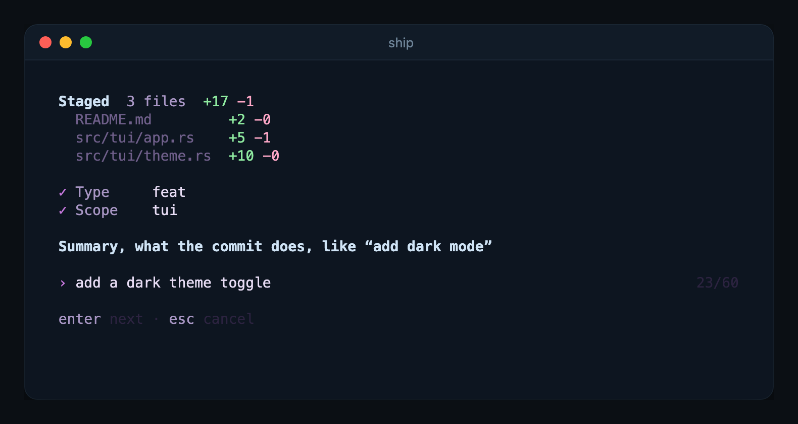

# ship

Conventional commits in your terminal.

Run `ship` in a git repository and it asks for each part of the message one
step at a time: type, scope, summary, and whether it breaks anything. Every
answer stays in your scrollback. Pass flags or pipe the summary in and it
commits without asking.



## Install

```sh
cargo install --path .
```

ship is built on [kiln](https://github.com/Zfinix/kiln), which it reads from
`../kiln`, so clone kiln next to this repository first.

## Usage

Walk through a commit:

```sh
ship
```

ship shows what is staged, then asks for the type, the scope (it suggests
one from the staged paths), the summary, and whether the change is breaking.
It shows the final message and commits when you confirm. If nothing is
staged, it offers to stage everything.

Commit without any questions:

```sh
ship -t feat -s cli -m "add the thing"
# ✓ Committed 815a4bd feat(cli): add the thing
```

Pipe the summary in:

```sh
echo "fix the resize bug" | ship -t fix
```

See the message without committing:

```sh
ship -t fix -m "fix the resize bug" --dry-run
# fix: fix the resize bug
```

Flags you leave out are asked for, so `ship -s cli` only skips the scope
step.

| Flag | What it does |
|---|---|
| `-t`, `--type <type>` | `feat`, `fix`, `docs`, `refactor`, `perf`, `test`, `build`, `ci`, `chore`, `style` or `revert` |
| `-s`, `--scope <scope>` | the part of the project the change touches |
| `-m`, `--message <text>` | the summary |
| `--breaking` | add `!` after the type and scope |
| `--all` | stage every change first, like `git add -A` |
| `--dry-run` | print the message and do not commit |
| `-q`, `--quiet` | print only errors |
| `--json` | print `{"hash","message"}` after committing |
| `--theme <name>` | the colour theme |

ship keeps the first line within 72 characters, strips a trailing period
from the summary, and starts it lowercase unless the first word looks like an
acronym or an identifier (`README`, `InlineTerm`, `Cargo.toml`). It never adds
trailers to the message.

When something goes wrong, ship says what happened and what to do next,
shows git's own output under it, and exits with status 1. Pressing esc at any
step exits with status 1 and commits nothing.

## Keys

| Key | Where | What it does |
|---|---|---|
| type | type list | filter the list |
| `1`-`9` | type list | pick by number |
| `↑` `↓` | type list | move |
| `tab` | scope | use the suggested scope |
| `←` `→` | yes/no questions | move between Yes and No |
| `y` `n` | yes/no questions | answer at once |
| `enter` | everywhere | confirm the step |
| `esc`, `ctrl+c` | everywhere | cancel without committing |

## Configuration

| Setting | Flag | Environment | Default |
|---|---|---|---|
| Theme | `--theme <name>` | `SHIP_THEME` | `orchid` |

Flags win over the environment. `ship --themes` lists every theme.

## License

Licensed under the [Apache License, Version 2.0](LICENSE).
